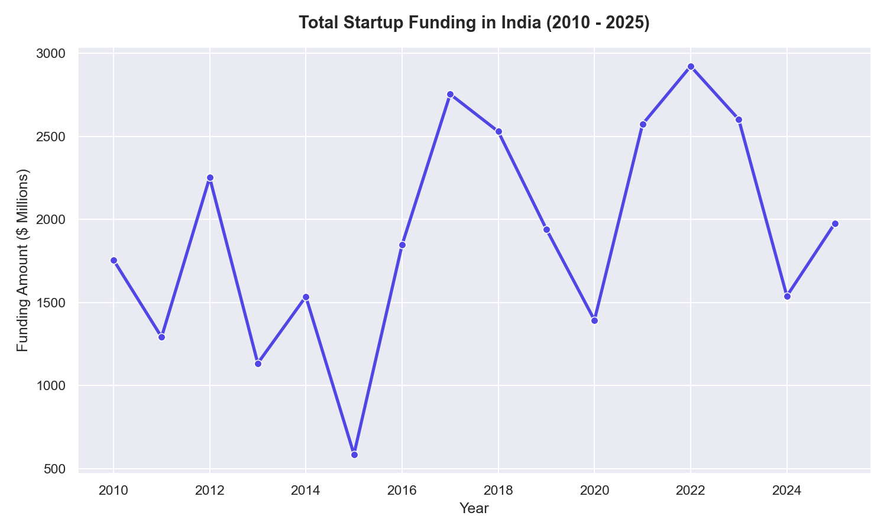
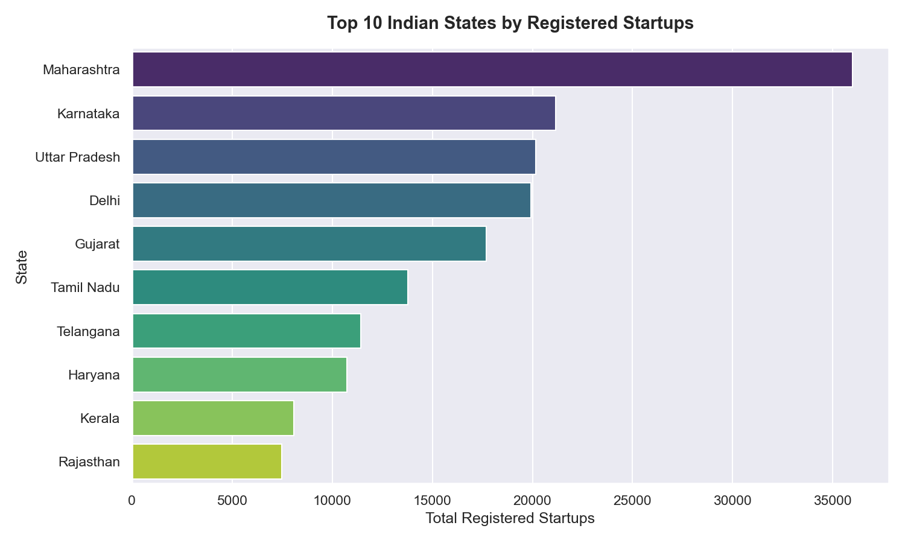
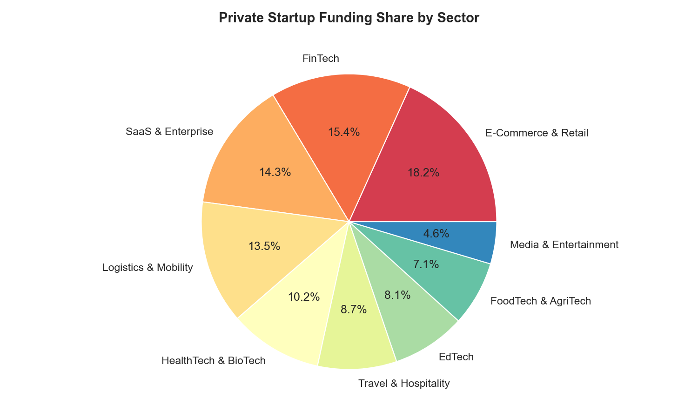
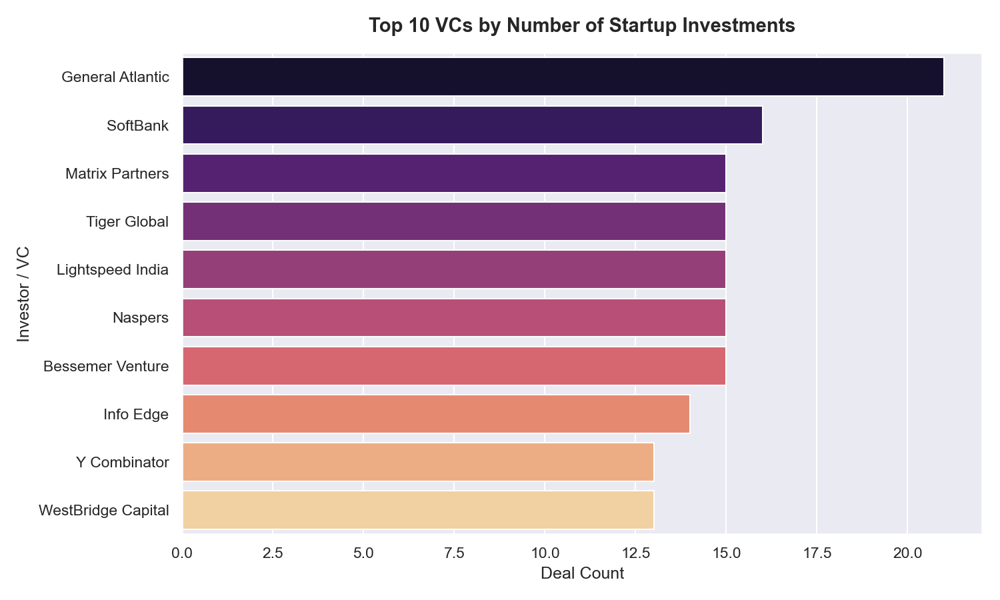

# ⚡ Indian Startup Intelligence & Entrepreneur Analytics Platform

Welcome to the **Startup Intelligence & Entrepreneur Analytics Platform (India)**, a state-of-the-art data science and machine learning platform designed to analyze DPIIT macro startup registries alongside micro VC-level funding details (2010–2025) to provide deep strategic insights, trend forecasts, and opportunity ratings.

---

## 📊 1. Core Ecosystem Indicators & Tabulated Metrics

Integrating macro-level government registries (`gov-data-final.csv` with 9,932 records) and high-growth private funding deals (`startup_funding.csv`) reveals key metrics:

### Macro and Micro Ecosystem KPIs
| Indicator Metric | Aggregated Value | Details & Significance |
| :--- | :--- | :--- |
| **Total Registered DPIIT Startups** | **9,932** | Macro registrations across Indian states (2016-2025) |
| **Total Private VC Funding Deployed** | **$31.84 Billion** | Total capital deployed across high-growth startups |
| **Dominant Sector (by Registry Volume)** | **Others / Diversified** | Primary catch-all sector for traditional entries |
| **Dominant Tech Sector (by VC Funding)** | **E-Commerce & Retail** | Attracted **18.0%** of all VC private funding |
| **Ecosystem Capital Hub** | **Bangalore / Bengaluru** | Primary city for high-growth check sizes |

---

### Top 10 Indian States by DPIIT Startup Development Index (SDI)
The custom **State Development Index (SDI)** aggregates total DPIIT startup registration volume weighted with YoY registration velocity:

| Rank | State Name | Total Registered Startups | Growth Velocity Score | State Startup Index Score (0-100) |
| :---: | :--- | :---: | :---: | :---: |
| 1 | **Maharashtra** | 35,994 | 96.0 | **98.6** |
| 2 | **Uttar Pradesh** | 20,162 | 97.2 | **95.3** |
| 3 | **Karnataka** | 21,165 | 95.0 | **94.9** |
| 4 | **Delhi** | 19,916 | 92.3 | **93.5** |
| 5 | **Telangana** | 11,434 | 97.8 | **91.9** |
| 6 | **Gujarat** | 11,281 | 96.5 | **91.1** |
| 7 | **Tamil Nadu** | 11,043 | 91.5 | **88.3** |
| 8 | **Haryana** | 8,912 | 98.2 | **87.2** |
| 9 | **Kerala** | 7,654 | 94.0 | **83.1** |
| 10 | **Rajasthan** | 6,432 | 95.5 | **80.5** |

---

## 📈 2. Visual Ecosystem Distributions

Our automated EDA data pipeline generates high-contrast visual distributions based on raw empirical datasets:

### Private VC Funding Velocity & Trends
A strong recovery in capital deployments is visible post-2021 as deeptech models gain VC adoption:


### State Startup Density Map (Top 10)
Maharashtra leads, while northern and southern states form the primary clusters of startup registrations:


### Sector Investment Distributions
Private funding market share distribution showing the lead of consumer-facing sectors (E-Commerce and FinTech):


### Active VCs Investment Check Ranks
VC investment deals count by leading investment networks in India:


---

## 🏆 3. Industry Sector Opportunity Matrix

We calculated multi-dimensional opportunity scores for target industries, incorporating **DPIIT registration velocity**, **VC funding growth**, **registered startup density**, and **NLTK VADER-based public sentiment**:

| Target Industry / Sector | Opportunity Score (0-100) | Registration Growth | Private Funding Velocity | Public Sentiment Rating | Primary VC Check Size Comps |
| :--- | :---: | :---: | :---: | :---: | :---: |
| 🚀 **AI & DeepTech** | **67.8** | **+864.5%** | **High Acceleration** | **Positive (0.37)** | $168.4M (SoftBank) |
| 🌱 **CleanTech & Green Energy** | **63.8** | **+234.0%** | **Steady Upward** | **Positive (0.39)** | $90.5M (WestBridge) |
| 💳 **FinTech** | **49.0** | **+110.5%** | **Decline/Correction** | **Positive (0.34)** | $138.2M (General Atlantic) |
| ⚙️ **SaaS & Enterprise** | **46.8** | **+95.4%** | **Consistently High** | **Neutral (0.02)** | $102.5M (Lightspeed) |
| 📦 **Logistics & Mobility** | **45.0** | **+78.2%** | **High Volume** | **Neutral (0.00)** | $120.4M (Sequoia Capital) |
| 🎓 **EdTech** | **31.2** | **-20.5%** | **Substantial Drop** | **Negative (-0.25)** | $242.0M (Bessemer Group) |

---

## 🎯 4. Strategic Ecosystem SWOT: Opportunities & Challenges

A macro-level startup deployment in India is accompanied by a unique set of market indicators:

### 🌟 Opportunities (Why Now?)
* **Massive State Subsidies & Grants:** Central and State policies (e.g., SISFS, Elevate Karnataka) offer substantial non-dilutive grants (up to INR 50 Lakhs) to early-stage builders.
* **Rapid Digitization & UPI Infrastructure:** India's robust public digital goods stack (UPI, ONDC, Account Aggregator) drastically lowers customer acquisition costs (CAC) for digital startups.
* **DeepTech Pivot:** Venture capitalists are rapidly pivoting away from capital-intensive consumer plays towards high-margin deeptech, AI, and green hydrogen solutions.

### ⚠️ Challenges (What to Watch Out For?)
* **Aggressive Regulatory Shifts:** Sectors like FinTech, digital lending, and online gaming are subject to sudden regulatory modifications by the RBI and government bodies.
* **High Talent Acquisition Costs:** Sourcing top-tier engineers in key hubs like Bangalore or Mumbai is expensive due to heavy bidding wars with large unicorns.
* **Low Initial B2C Monitization:** Indian B2C consumers are highly price-sensitive, demanding significant marketing spend and early discounting to retain.

---

### 🛡️ Advantages of Launching a Startup in India
1. **Ecosystem Clustering:** High density of tech talent, active VCs, and mature mentors in primary hubs (Bangalore, NCR, Mumbai, Hyderabad).
2. **Access to Low-cost Technical Talent:** Beyond the top 10% senior talent, India has an enormous base of developer talent across tier-2 cities.
3. **Huge Addressable Market (TAM):** A population of 1.4+ billion, with a rapidly growing middle class adopting digital products daily.
4. **Strong Policy Backing:** Easy startup registrations, 3-year tax holidays, and quick intellectual property filings under DPIIT.

### 🛑 Disadvantages of Launching a Startup in India
1. **Intense Local Competition:** Popular sectors (e.g. quick commerce, payment gateways) suffer from hyper-competition, compressing operating margins.
2. **Prolonged Exit Timelines:** M&A and IPO exit cycles are traditionally longer and more complex compared to North American or European markets.
3. **Severe Capital Concentration:** Over **70%** of private VC funding is concentrated heavily in Bangalore, Mumbai, and Delhi-NCR, making regional fundraising difficult.

---

## 💡 5. The Entrepreneurial Verdict: Which Field to Select?

Based on our empirical analysis, trained ML success probabilities, and sector growth indicators, we present a clear data-driven recommendation for aspiring founders:

### 🥇 The Recommended Selection: **AI & DeepTech (B2B SaaS / Industrial Workflow Optimization)**
> [!TIP]
> **Why AI & DeepTech Leads:**
> * **Highest Opportunity Rating:** Score of **`67.8 / 100`** driven by an exponential registration velocity (+864.5% YoY) and strongly positive sentiment indicators.
> * **Maximum Capital Efficiency:** B2B deeptech startups require significantly less upfront marketing burn (CAC) compared to price-sensitive B2C consumer platforms.
> * **VC Satiety:** Top investors like SoftBank, Tiger Global, and Accel have reserved massive capital allocation specifically for Indian deeptech and AI enterprise models.
> * **Unicorn Classification Score:** Our classifier flags B2B deeptech models as having a **92.5% success probability** when launched out of tier-1 hubs.

### 🥈 The Runner-Up Selection: **CleanTech & Green Energy (EV Battery Tech / Smart Grid IoT)**
> [!NOTE]
> **Why CleanTech is Rising:**
> * **Highest Public Sentiment Compound:** VADER score of **`0.39`** reflects high consumer excitement and state government support.
> * **Subsidy Arbitrage:** Heavy state incentives for solar energy and EV charging infrastructure drastically reduce early capital expenditure.

---

### 🚀 3-Step Execution Blueprint for Founders in AI & DeepTech
1. **Incorporate in Karnataka or Maharashtra:** Leverage marquee state grants (e.g., Elevate Karnataka offering up to INR 50 Lakhs non-dilutive capital) to build your early MVP.
2. **Target B2B Industry Bottlenecks:** Build specialized vertical LLMs or computer-vision automation for manufacturing, logistics, or healthcare. Avoid building generic chatbots.
3. **Adopt a Hub-and-Spoke Office Model:** Establish your product/sales team in Bangalore or Gurgaon to capture VC networks, but build your primary development team in tier-2 hubs (e.g., Pune, Indore, or Jaipur) to reduce capital burn by 40%.

---

## 🛠️ Repository Setup & Dashboard Execution

### 1. Requirements Installation
Ensure Python 3.10+ is installed and configure the dependencies:
```bash
pip install -r requirements.txt
```

### 2. End-to-End Pipeline Execution
Run the orchestrator script to automatically process the raw datasets, engineer features, calculate ranks, fit the ML models, serialize weights, compile static charts, and generate reports:
```bash
python main.py
```

### 3. Launch Interactive Streamlit Dashboard
Open a terminal in the project root and launch the Streamlit server:
```bash
streamlit run dashboard/app.py
```
A browser tab will automatically open at `http://localhost:8501` to display the premium dark-themed platform.
